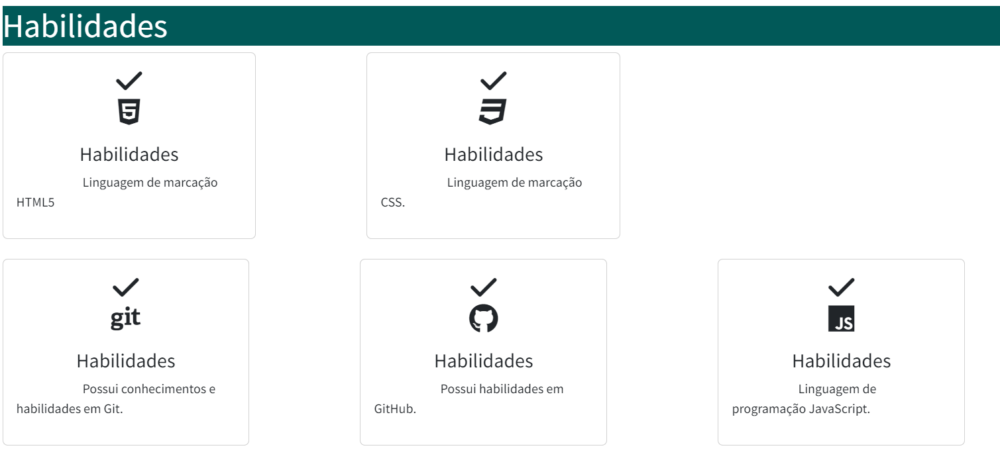
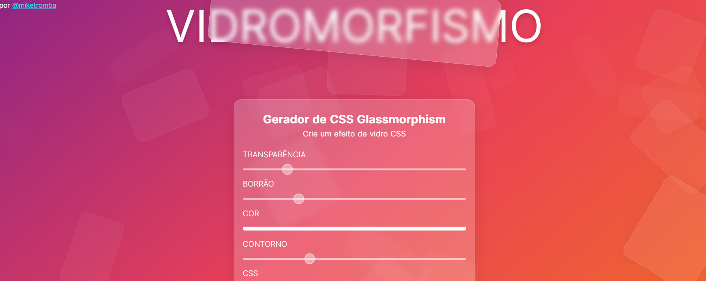
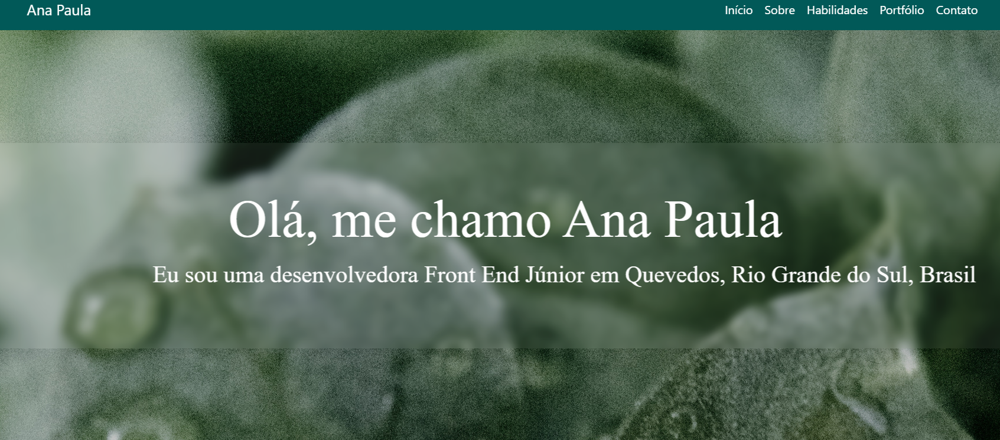

# Projeto Portfólio
## Estrutura básica 

 Foram seguidas as seções trabalhadas em aula (**section**) para dividir as seções de conteúdo e para dividir linhas de conteúdo.

  

## Bootstrap

 A grande vantagem dessa framework é a praticidade. Os desenvolvedores tem menos o que se preocupar em termos de código. É uma boa pedida para criar pontes de relacionamento entre desenvolvedores, e outra vantagem é poder discutir sobre a framework.  

   

 

 ## Glasmorphism

 
 O efeito glassmorfismo é elegante,  bonito e revela uma paz a quem vê. Explorar o efeito torna o site atraente para cada usuário que tem acesso a esse efeito. 
 
 

 	 
 

 	

   

 
